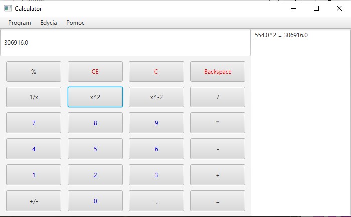
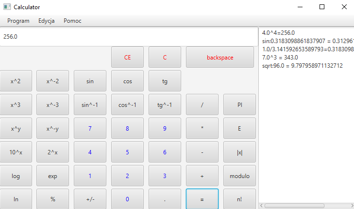
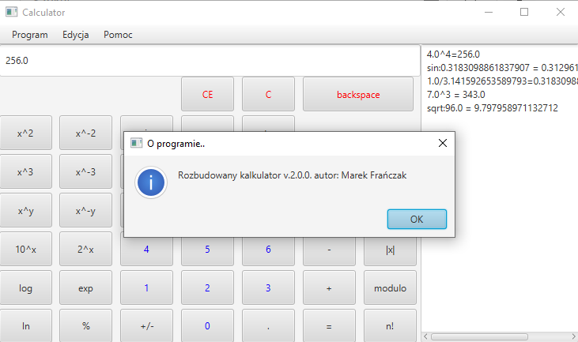

# CALCULATOR

**CALCULATOR** is a app for simply two-component calculations. The app consists of two mode: simply and scientific. Scientific mode has additional function such as: sin, factorial or cube.

**Status** - Second version of app. A new feature is to use OpenJFX framework instead of the swing library.

## Table of contents

* Author
* Technologies
* General info

## Author
[Marek Frańczak](https://github.com/marekfranczak)

## Technologies
* Java 17 [Object-oriented programming language] (https://www.java.com/)
* IntelliJ IDEA 2022.2.3 [Java IDE] (https://www.jetbrains.com/idea/)
* OpenJFX [Java framework for building desktop applications] (https://openjfx.io/)

## General info
Will be soon

## License
For open source projects, say how it is licensed.
